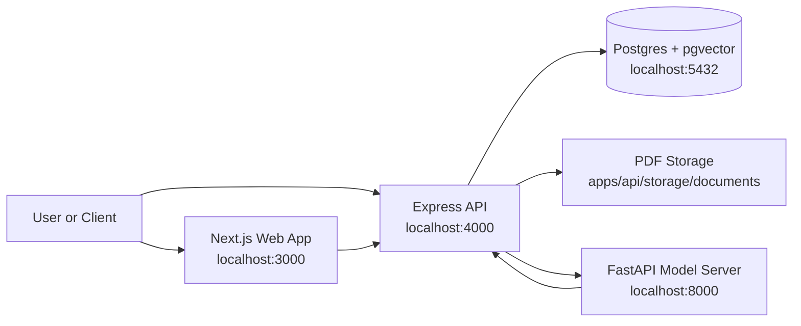

# System Architecture

The app uses a service-oriented local architecture.

## Design Intent

The API is the coordinator. It owns the public routes, validates requests, stores metadata, calls the model server, and queries Postgres.

The model server focuses on PDF layout extraction. It does not own database writes.

Postgres stores both structured metadata and retrieval indexes:

- relational document records
- chunk records
- pgvector embeddings
- generated full-text search vectors

## Key Notes

- The frontend is still a placeholder status page.
- Upload and retrieval can already be tested directly through the API.
- Embeddings are generated when chunks are stored.
- Retrieval is hybrid: vector search plus keyword search plus RRF.

Related notes:

- [[Architecture/Services]]
- [[Architecture/Code Map]]
- [[Database/Database Schema]]

