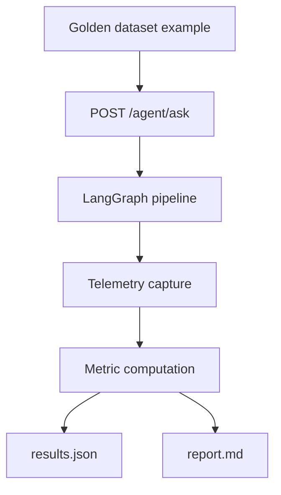

# Evaluation Pipeline

## Runtime Flow



## CLI

```powershell
python -m evaluation.evaluator
```

The evaluator:

1. Loads `config/evaluation.yaml`.
2. Loads all examples from `evaluation/golden_dataset.jsonl`.
3. Executes full API agent pipeline for each example.
4. Computes retrieval, answer, citation, numeric, latency, and cost metrics.
5. Writes `evaluation/results.json` and `evaluation/report.md`.

## Inputs

- golden examples (`id`, `document_id`, `question`, expected answer, required chunks/page, answer type)
- evaluation configuration (`top_k`, tolerance, batch size, tracing flags)
- API response state (`retrievedChunks`, `extractedFacts`, `citations`, `finalAnswer`, `telemetry`)

## Outputs

- machine-readable benchmark output: `evaluation/results.json`
- human-readable summary report: `evaluation/report.md`

## Extending

- Add questions by appending JSONL rows in [[Evaluation/Golden Dataset]].
- Tune thresholds in `config/evaluation.yaml`.
- Extend metric functions in `evaluation/metrics.py`.

Related:

- [[Evaluation/Metrics]]
- [[Evaluation/Langfuse Observability]]
- [[Milestones/Milestone 7 - Evaluation]]

