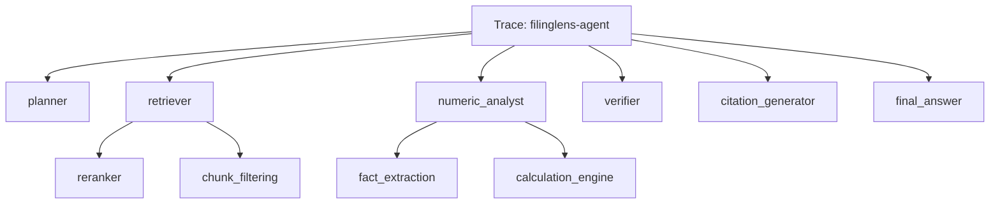

# Langfuse Observability

Tracing is implemented in:

```text
apps/api/src/observability/agentTracing.ts
```

## Trace Hierarchy



## Captured Fields

- input question and document ID
- stage duration and status
- per-stage metadata (chunk IDs, pages, scores, counts)
- stage errors
- question ID, document ID, evaluation ID
- total prompt/completion token counters
- estimated cost

## Configuration

Environment variables:

- `LANGFUSE_ENABLED=true|false`
- `LANGFUSE_PUBLIC_KEY`
- `LANGFUSE_SECRET_KEY`
- `LANGFUSE_HOST` (optional; defaults to `https://cloud.langfuse.com`)

Evaluation controls:

- `config/evaluation.yaml`:
  - `langfuse_enabled`
  - `save_traces`

## Failure Behavior

Tracing failures are logged and do not stop graph execution. Node failures still emit span completion with error metadata.

## Troubleshooting Failed Evaluations

- Check API availability at `GET /health`.
- Check that `document_id` from golden dataset exists.
- Inspect `state.errors` and stage telemetry in `evaluation/results.json`.
- If traces are missing, verify Langfuse env vars and connectivity.

Related:

- [[Workflows/LangGraph Agent Workflow]]
- [[Evaluation/Evaluation Pipeline]]
- [[Milestones/Milestone 7 - Evaluation]]

