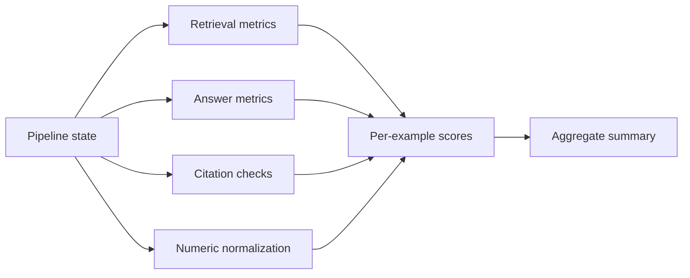

# Metrics

## Retrieval Metrics

- **Retrieval Hit Rate**: `required_chunks ⊆ retrieved_chunks`
- **Context Precision**: `useful_retrieved / total_retrieved`
- **Context Recall**: `matched_required / total_required`

## Answer Quality Metrics

- **Faithfulness**: factual numerics in answer must be supported by extracted facts.
- **Answer Relevancy**: keyword overlap between question and answer.
- **Citation Accuracy**: cited chunk and page must exist and map to supporting facts.
- **Numeric Accuracy**: expected and predicted values must be equivalent under tolerance.

## Numeric Normalization Rules

The evaluator normalizes and compares:

- `201.183 billion`
- `201.183B`
- `$201.183 billion`
- `201183 million`
- percentages and basis points (`1.25%` == `125 bps`)

## Metric Computation Flow

## Interpreting Scores

- High retrieval hit + low faithfulness usually indicates answer synthesis failure.
- High faithfulness + low citation accuracy usually indicates citation-builder mismatch.
- Low numeric accuracy with high relevancy usually indicates unit/scale conversion issues.

Related:

- [[Evaluation/Evaluation Pipeline]]
- [[Evaluation/Langfuse Observability]]

