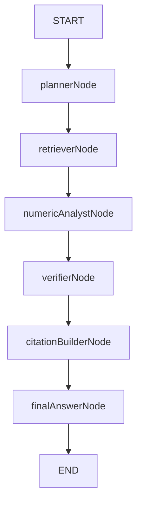

# Milestone 6 - LangGraph Agent System

## Objective

Convert the retrieval workflow into a LangGraph agent pipeline that performs planning, retrieval, analysis, verification, citation construction, and answer generation.

## Completed Work

- Added shared typed `FilingLensState`.
- Added isolated graph nodes.
- Added compiled LangGraph workflow.
- Added `runAgent(question, documentId)`.
- Added `POST /agent/ask`.
- Added deterministic numeric analysis.
- Added verification before answer generation.
- Added structured citation construction.
- Added tests for nodes and graph execution.

## Graph Lifecycle



## State Fields

- `question`
- `documentId`
- `plan`
- `retrievedChunks`
- `extractedFacts`
- `calculations`
- `draftAnswer`
- `verification`
- `citations`
- `finalAnswer`
- `errors`

## Architecture Changes

New API files:

- `apps/api/src/agents/state.ts`
- `apps/api/src/agents/graph.ts`
- `apps/api/src/agents/index.ts`
- `apps/api/src/agents/nodes/plannerNode.ts`
- `apps/api/src/agents/nodes/retrieverNode.ts`
- `apps/api/src/agents/nodes/numericAnalystNode.ts`
- `apps/api/src/agents/nodes/verifierNode.ts`
- `apps/api/src/agents/nodes/citationBuilderNode.ts`
- `apps/api/src/agents/nodes/finalAnswerNode.ts`
- `apps/api/src/llm/agentLlm.ts`
- `apps/api/src/agentRoutes.ts`

## Testing Strategy

The tests mock retrieval and LLM behavior so graph behavior is deterministic.

Run:

```powershell
pnpm --filter api test
pnpm --filter api build
```

## Future Improvements

- Replace deterministic planning/final-answer generation with a production LLM provider.
- Add richer fact extraction for tables.
- Add conflict detection across pages and periods.
- Add streaming graph output.
- Persist graph traces for observability.

Related notes:

- [[Workflows/LangGraph Agent Workflow]]
- [[Workflows/Hybrid Retrieval Workflow]]
- [[API/API Reference]]
- [[Tests/Test Strategy]]

