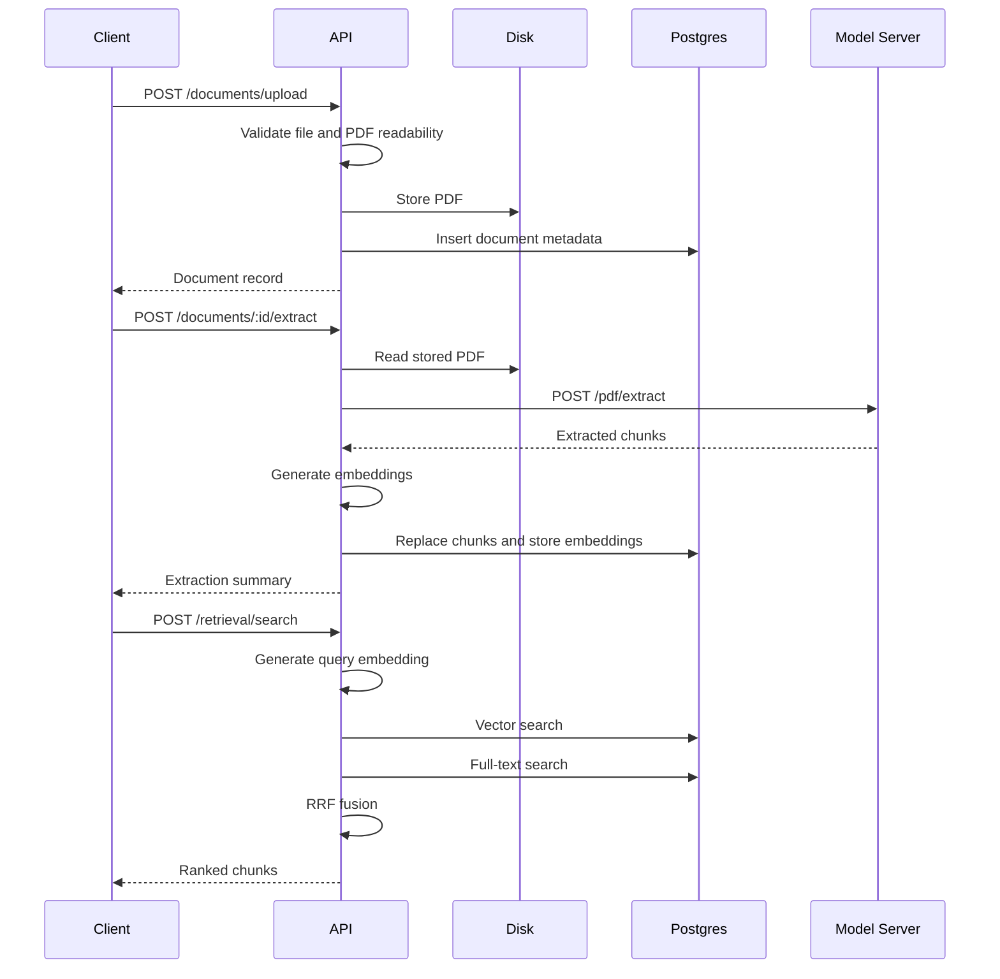

# End-to-End Document Workflow

This is the main data flow from upload to retrieval.

## Steps

1. Upload PDF.
2. Validate PDF and store file.
3. Insert document metadata.
4. Trigger extraction.
5. Extract regions using the model server.
6. Store chunks with embeddings.
7. Search chunks using hybrid retrieval.

Related notes:

- [[Workflows/PDF Extraction Workflow]]
- [[Workflows/Hybrid Retrieval Workflow]]
- [[API/API Reference]]

