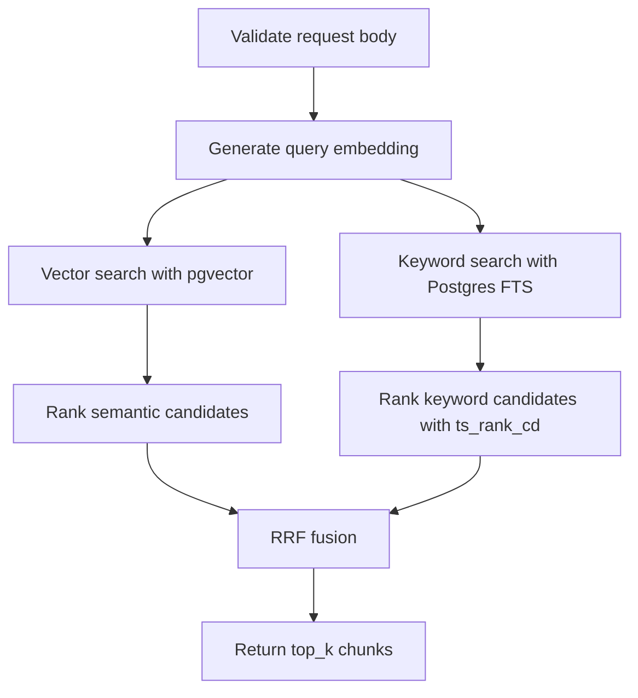

# Hybrid Retrieval Workflow

Hybrid retrieval combines semantic search and keyword search to find the best chunks.

## Why Hybrid

Dense embeddings are good at meaning.

Keyword search is good at exact terms.

Financial documents often need both:

- exact years
- exact labels
- exact numbers
- ticker symbols
- accounting terms
- semantically related descriptions

## Request

```http
POST /retrieval/search
```

Example:

```json
{
  "document_id": "doc_1",
  "query": "R&D expense 2024 revenue",
  "region_type": "table",
  "top_k": 8
}
```

## Retrieval Flow



## Semantic Search

File: `apps/api/src/retrieval.ts`

Semantic search uses:

```sql
embedding <=> query_embedding
```

This is pgvector cosine distance when used with the `vector_cosine_ops` index.

The query returns:

```sql
1 - (embedding <=> query_embedding) AS score
```

## Keyword Search

Keyword search uses:

```sql
websearch_to_tsquery('english', query)
```

and ranks with:

```sql
ts_rank_cd(search_vector, query, 32)
```

This is BM25-like ranking through Postgres full-text search. It is not a custom BM25 implementation.

## RRF Fusion

RRF means Reciprocal Rank Fusion.

Formula:

```text
score += 1 / (rrf_k + rank)
```

Current `rrf_k`:

```text
60
```

The system adds RRF contributions from:

- vector ranking
- keyword ranking

Chunks that rank well in both lists usually rise to the top.

## Metadata Filters

Currently supported:

- `document_id`
- `region_type`

Both filters are applied to both vector search and keyword search.

This makes the retrieval layer extensible for future filters such as:

- ticker
- filing type
- page range
- company name
- date

Related notes:

- [[Glossary/Retrieval Glossary]]
- [[Milestones/Milestone 4 - Hybrid Retrieval]]
- [[API/API Reference]]

