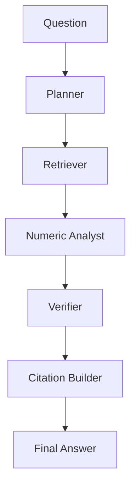

# LangGraph Agent Workflow

Milestone 6 replaces a simple retrieval-to-answer flow with a LangGraph state machine.

## Graph



## State Model

The graph passes a shared `FilingLensState` through every node.

Main fields:

- `question`
- `documentId`
- `plan`
- `retrievedChunks`
- `extractedFacts`
- `calculations`
- `draftAnswer`
- `verification`
- `citations`
- `finalAnswer`
- `errors`

The state is defined in:

```text
apps/api/src/agents/state.ts
```

## Node Responsibilities

### Planner

File:

```text
apps/api/src/agents/nodes/plannerNode.ts
```

Responsibilities:

- classify question type
- create subquestions
- determine required evidence types
- decide whether calculations are needed

### Retriever

File:

```text
apps/api/src/agents/nodes/retrieverNode.ts
```

Responsibilities:

- call hybrid retrieval
- use planner evidence requirements
- deduplicate chunks
- rank chunks

### Numeric Analyst

File:

```text
apps/api/src/agents/nodes/numericAnalystNode.ts
```

Responsibilities:

- extract numeric facts
- perform deterministic calculations
- avoid LLM arithmetic

### Verifier

File:

```text
apps/api/src/agents/nodes/verifierNode.ts
```

Responsibilities:

- check evidence sufficiency
- flag unsupported facts
- check calculation consistency
- produce confidence and warnings

### Citation Builder

File:

```text
apps/api/src/agents/nodes/citationBuilderNode.ts
```

Responsibilities:

- build structured citations
- link facts and calculations to retrieved chunks
- avoid inline formatting decisions

### Final Answer

File:

```text
apps/api/src/agents/nodes/finalAnswerNode.ts
```

Responsibilities:

- use only verified information
- refuse unsupported claims
- preserve numerical accuracy
- attach citations
- produce markdown

## API Entry

```http
POST /agent/ask
```

The route invokes:

```text
runAgent(question, documentId)
```

which initializes state and invokes the compiled graph.

## Error Handling

Every node catches recoverable errors, logs them, and appends messages to `state.errors`.

Unrecoverable request validation errors happen before graph execution.

## Testing

Tests cover:

- planner output
- retrieval flow
- calculation path
- verification
- citation generation
- graph execution
- missing evidence
- retrieval failures
- mocked LLM behavior

Related notes:

- [[Milestones/Milestone 6 - LangGraph Agent System]]
- [[Workflows/Hybrid Retrieval Workflow]]
- [[API/API Reference]]
- [[Tests/Test Strategy]]

