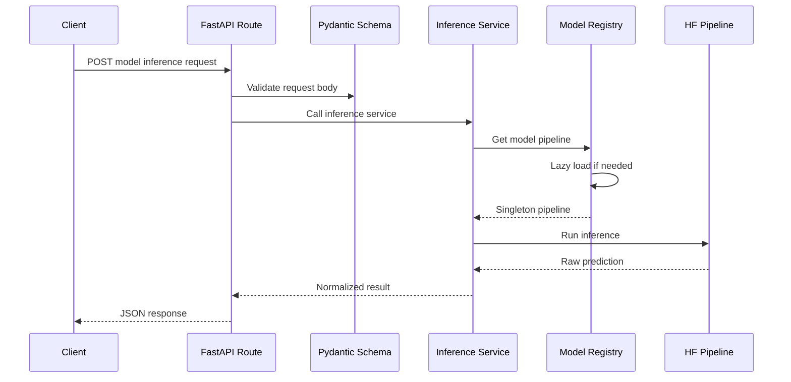
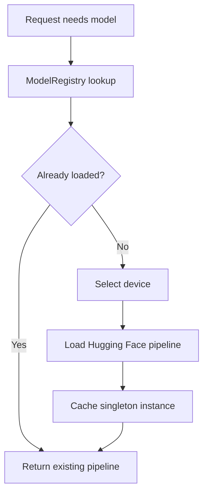

# Model Server Inference Workflow

Milestone 5 adds inference APIs to the FastAPI model server.

Implemented endpoints:

- `POST /table/qa`
- `POST /verify/nli`
- `POST /layout/document-qa`
- `POST /vision/qa`
- `POST /classify/section`

## Request Flow



## Model Loading



## Table QA Pipeline

Endpoint:

```http
POST /table/qa
```

Purpose:

Answer questions over structured JSON tables.

Service:

```text
apps/model-server/app/services/table_qa_service.py
```

Flow:

1. Validate table and question with Pydantic.
2. Convert JSON rows into a pandas DataFrame.
3. Validate consistent columns.
4. Load or reuse TAPAS-style pipeline.
5. Return extracted answer.

Default model:

```text
google/tapas-base-finetuned-wtq
```

## NLI Pipeline

Endpoint:

```http
POST /verify/nli
```

Purpose:

Verify whether a premise supports, contradicts, or is neutral toward a hypothesis.

Service:

```text
apps/model-server/app/services/nli_service.py
```

Flow:

1. Validate premise and hypothesis.
2. Load or reuse NLI pipeline.
3. Run pair classification with truncation.
4. Normalize labels to `ENTAILMENT`, `CONTRADICTION`, or `NEUTRAL`.
5. Return label and confidence score.

Default model:

```text
cross-encoder/nli-deberta-v3-small
```

## Layout Document QA Pipeline

Endpoint:

```http
POST /layout/document-qa
```

Purpose:

Answer questions over document images where layout matters.

Service:

```text
apps/model-server/app/services/layout_document_qa_service.py
```

Flow:

1. Validate base64 image and question.
2. Decode the image into RGB.
3. Load or reuse the document QA pipeline.
4. Return answer and optional confidence score.

Default model:

```text
impira/layoutlm-document-qa
```

## Vision QA Pipeline

Endpoint:

```http
POST /vision/qa
```

Purpose:

Answer questions about general images.

Service:

```text
apps/model-server/app/services/vision_qa_service.py
```

Flow:

1. Validate base64 image and question.
2. Decode the image into RGB.
3. Load or reuse the visual question answering pipeline.
4. Return answer and optional confidence score.

Default model:

```text
dandelin/vilt-b32-finetuned-vqa
```

## Section Classification Pipeline

Endpoint:

```http
POST /classify/section
```

Purpose:

Classify document text into a section label.

Service:

```text
apps/model-server/app/services/section_classifier_service.py
```

Flow:

1. Validate text and candidate labels.
2. Load or reuse the zero-shot classifier.
3. Classify text against the candidate labels.
4. Return the best label and confidence score.

Default model:

```text
facebook/bart-large-mnli
```

## Limitations

- First real request may be slow because models load lazily.
- Table QA quality depends on TAPAS behavior and input table cleanliness.
- NLI truncates long inputs to `MODEL_MAX_SEQUENCE_LENGTH`.
- Layout document QA and vision QA require base64-encoded images.
- No batching is exposed yet, though `MODEL_BATCH_SIZE` is reserved.

Related notes:

- [[Milestones/Milestone 5 - Model Server]]
- [[Architecture/Services]]
- [[API/API Reference]]
- [[Tests/Test Strategy]]

