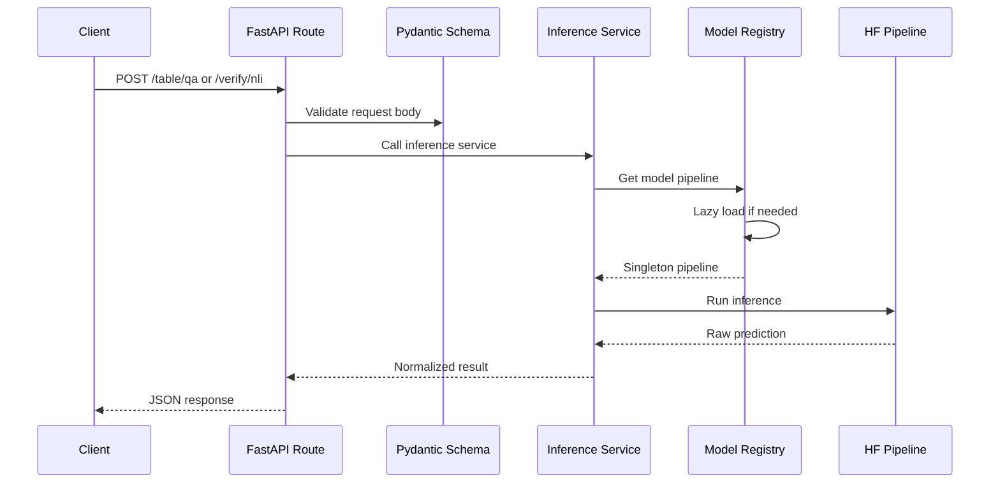
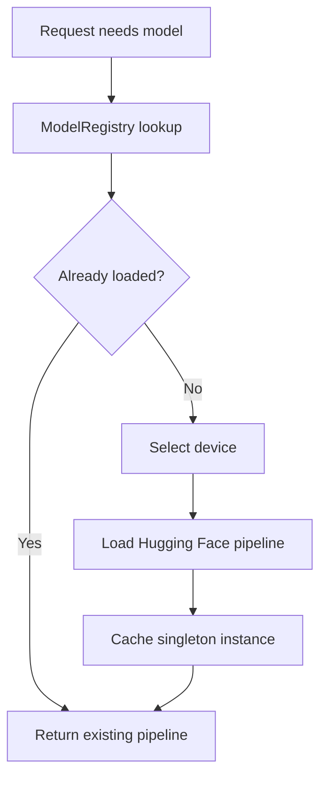

# Model Server Inference Workflow

Milestone 5 adds MVP inference APIs to the FastAPI model server.

Implemented endpoints:

- `POST /table/qa`
- `POST /verify/nli`

Future endpoints are planned but not fully implemented:

- `POST /layout/document-qa`
- `POST /vision/qa`
- `POST /classify/section`

## Request Flow



## Model Loading



## Table QA Pipeline

Endpoint:

```http
POST /table/qa
```

Purpose:

Answer questions over structured JSON tables.

Service:

```text
apps/model-server/app/services/table_qa_service.py
```

Flow:

1. Validate table and question with Pydantic.
2. Convert JSON rows into a pandas DataFrame.
3. Validate consistent columns.
4. Load or reuse TAPAS-style pipeline.
5. Return extracted answer.

Default model:

```text
google/tapas-base-finetuned-wtq
```

## NLI Pipeline

Endpoint:

```http
POST /verify/nli
```

Purpose:

Verify whether a premise supports, contradicts, or is neutral toward a hypothesis.

Service:

```text
apps/model-server/app/services/nli_service.py
```

Flow:

1. Validate premise and hypothesis.
2. Load or reuse NLI pipeline.
3. Run pair classification with truncation.
4. Normalize labels to `ENTAILMENT`, `CONTRADICTION`, or `NEUTRAL`.
5. Return label and confidence score.

Default model:

```text
cross-encoder/nli-deberta-v3-small
```

## MVP Limitations

- First real request may be slow because models load lazily.
- Table QA quality depends on TAPAS behavior and input table cleanliness.
- NLI truncates long inputs to `MODEL_MAX_SEQUENCE_LENGTH`.
- No batching is exposed yet, though `MODEL_BATCH_SIZE` is reserved.
- No document layout QA, vision QA, or section classification yet.

Related notes:

- [[Milestones/Milestone 5 - Model Server]]
- [[Architecture/Services]]
- [[API/API Reference]]
- [[Tests/Test Strategy]]

